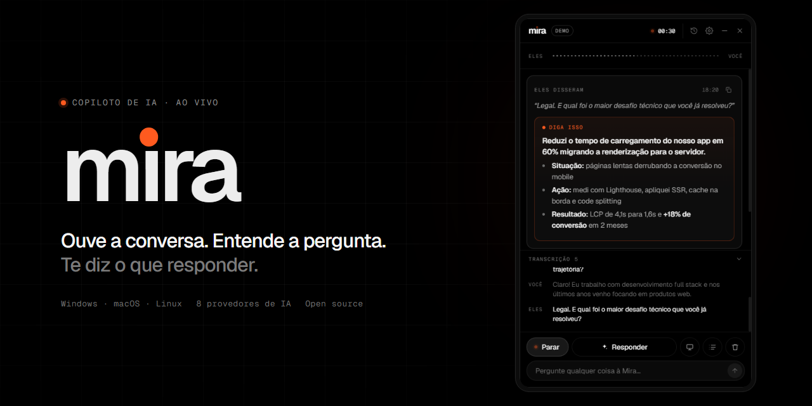
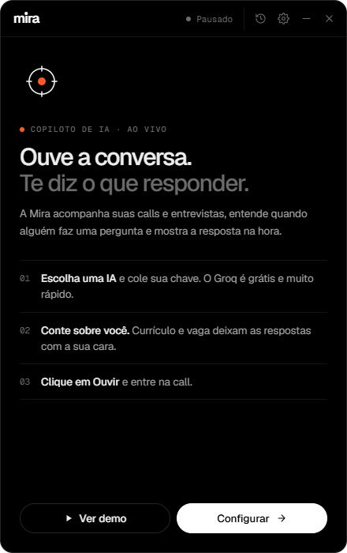
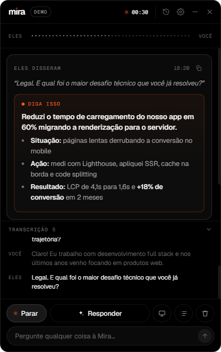
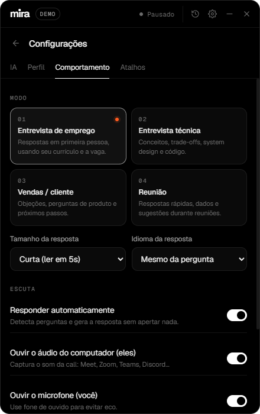

<p align="center">
  
</p>

<p align="center">
  <b>Mira</b> é um copiloto de IA para reuniões e entrevistas. Ela ouve a call, entende quando alguém faz uma pergunta e mostra a resposta ideal em tempo real, numa janela flutuante sobre qualquer app.
</p>

<p align="center">
  
  
  
  
  
</p>

---

## ✨ O que ela faz

| | |
|---|---|
| 🎧 **Transcrição em dupla** | Separa **Eles** (áudio do sistema: Meet, Zoom, Teams, Discord…) de **Você** (microfone). |
| ⚡ **Respostas ao vivo** | Detecta perguntas automaticamente (PT/EN) e gera a resposta em *streaming*: a primeira linha já é a frase pronta pra falar. |
| 🧠 **Com a sua cara** | Usa o seu currículo, a descrição da vaga e suas notas como contexto. Respostas em primeira pessoa, com STAR em perguntas comportamentais. |
| 🔌 **8 provedores de IA** | Groq, OpenAI, Gemini, Anthropic Claude, OpenRouter, **Ollama** e **LM Studio** (100% local/offline) ou qualquer endpoint compatível com OpenAI. |
| 🖥️ **Análise de tela** | Um atalho tira um print (sem a Mira aparecer nele) e a IA resolve o desafio de código ou a pergunta visível. |
| 📝 **Resumo e histórico** | Resumo da reunião com pontos principais e próximos passos. As sessões ficam salvas com título gerado por IA e podem ser exportadas em Markdown. |
| 🎭 **4 modos** | Entrevista de emprego, entrevista técnica, vendas e reunião. |
| 🎬 **Modo demonstração** | Simula uma entrevista completa, **sem microfone e sem chave de API**. Ideal para apresentar o projeto. |

## 🛡️ À prova de bloqueio de navegador

A Mira é um **app nativo** (Electron), não uma extensão nem um site, então nada do navegador pode travá-la:

- **Sem CORS e sem adblock:** todas as chamadas de IA saem do processo principal (Node.js), e não da página.
- **Sem pop-up de permissão:** o áudio do sistema é capturado via *loopback* nativo do sistema operacional, sem o seletor de compartilhamento do navegador.
- **Funciona com qualquer app de call:** Meet no Chrome, Zoom, Teams, Discord, Slack. Se toca no seu PC, a Mira ouve.
- **Não dorme em segundo plano:** o `backgroundThrottling` fica desligado, então ela continua ouvindo sem estar em foco.
- **Chaves protegidas:** ficam criptografadas com o cofre do sistema (DPAPI no Windows, Keychain no macOS) e nunca chegam ao front-end.

## 📸 Telas

<p align="center">
  
  
  
</p>

## 🚀 Como rodar

```bash
git clone <url-do-repo> mira
cd mira
npm install
npm run dev
```

1. Na tela de boas-vindas, clique em **Ver demo** para testar na hora, ou em **Configurar agora**.
2. Em **⚙ → IA**, escolha o provedor e cole a chave. O [Groq](https://console.groq.com/keys) é grátis, muito rápido e cobre transcrição + resposta com uma chave só.
3. Em **⚙ → Perfil**, cole seu currículo e a descrição da vaga.
4. Clique em **Ouvir** e entre na call. 🎧 Use fone de ouvido para um áudio mais limpo (a Mira também filtra o eco automaticamente).

### Gerar o instalador

```bash
npm run dist        # Windows (.exe)
npm run dist:mac    # macOS (.dmg)
npm run dist:linux  # Linux (.AppImage)
```

> **macOS:** o áudio do sistema exige um dispositivo virtual como o [BlackHole](https://github.com/ExistentialAudio/BlackHole). No Windows funciona nativamente.

## ⌨️ Atalhos globais

Funcionam em qualquer app, mesmo com a Mira em segundo plano (no macOS, use `⌘` no lugar de `Ctrl`).

| Atalho | Ação |
|---|---|
| `Ctrl` `Shift` `Space` | Mostrar / esconder a Mira |
| `Ctrl` `Shift` `L` | Começar / parar de ouvir |
| `Ctrl` `Shift` `Enter` | Responder agora |
| `Ctrl` `Shift` `H` | Analisar a tela |
| `Ctrl` `Shift` `R` | Resumo da conversa |
| `Ctrl` `Shift` `M` | Modo fantasma (os cliques atravessam a janela) |
| `Ctrl` `Alt` `← ↑ → ↓` | Mover a janela |

## 🏗️ Arquitetura

```
┌──────────────── Renderer (React) ────────────────┐      ┌──────── Main (Node/Electron) ────────┐
│                                                   │      │                                      │
│  Mic ─┐                                           │      │  desktopCapturer (loopback de áudio) │
│       ├─ AudioWorklet → VAD (energia adaptativa)  │ IPC  │  STT: /audio/transcriptions          │
│  Sys ─┘   → segmento WAV 16kHz ───────────────────┼─────▶│  LLM: streaming SSE (OpenAI/Claude)  │
│                                                   │      │  safeStorage (chaves criptografadas) │
│  transcrição → anti-eco → detector de pergunta    │◀─────┼─ deltas do stream                    │
│      → prompt (perfil + vaga + conversa)          │      │  atalhos globais, janela overlay     │
│      → card de resposta em streaming              │      │  sessões em JSON (histórico)         │
└───────────────────────────────────────────────────┘      └──────────────────────────────────────┘
```

- **`src/shared`**: lógica pura e testada: VAD, encoder WAV, reamostragem, parser SSE, detecção de pergunta, filtro de alucinações do Whisper, anti-eco e prompts.
- **`src/main`**: janela, captura, rede e armazenamento.
- **`src/preload`**: ponte tipada e isolada (`contextIsolation`).
- **`src/renderer`**: interface React com onda sonora em canvas e markdown renderizado sem `innerHTML`.

### Decisões técnicas

- **VAD próprio em vez de streaming contínuo:** a fala é cortada nas pausas naturais, o que gera frases completas, menos alucinação e custo baixo. Segmentos longos são cortados em 12s para manter o "ao vivo".
- **Auto-resposta com debounce:** espera ~0,9s de silêncio do interlocutor. Se a pessoa continuar a pergunta, o mesmo card é regenerado em vez de criar um novo.
- **Perguntas de cortesia** ("tudo bem?", "consegue me ouvir?") são ignoradas.
- **Anti-eco bidirecional:** se o microfone captou a voz da call, a fala duplicada é removida, mesmo quando chega antes da original.

## 🧪 Testes

```bash
npm test          # vitest: VAD, WAV, SSE, detecção de perguntas, anti-eco, prompts
npm run typecheck
```

## 🎨 Identidade visual

Preto, tipografia grotesca ([Geist](https://vercel.com/font)) e **uma única cor de acento**: o laranja de sinal `#FF5A1F`, a luz de "gravando". Ele só aparece no que está ao vivo: o ponto de escuta, o rótulo "diga isso" e o cursor da resposta.

- **Símbolo:** um retículo de precisão (a *mira*) com o ponto de sinal no centro.
- **Wordmark:** `mira` em minúsculas, com o pingo do **i** sendo o ponto de sinal, que pulsa quando ela está ouvindo.

O ícone é gerado por código em [`scripts/make-art.mjs`](scripts/make-art.mjs) e o banner em [`scripts/art/banner.html`](scripts/art/banner.html) (`npm run art`).

## 📄 Licença

MIT
